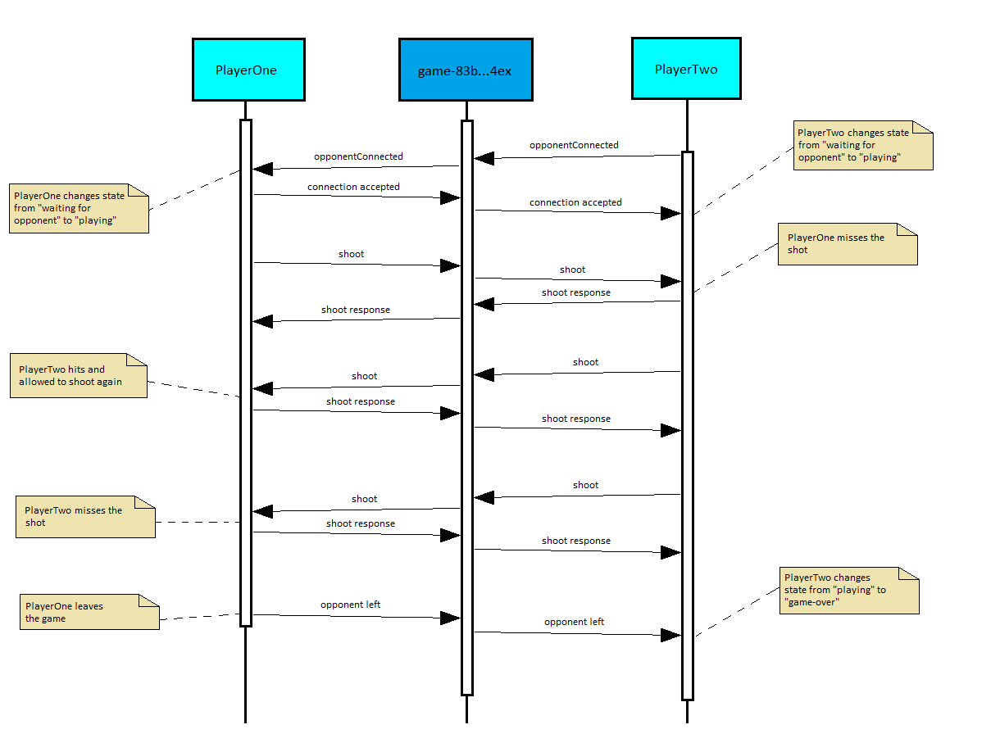

# Battleship
A Battleship game implementation for learning new technologies. The game is a WPF application where the connection is established via RabbitMQ.

# Technologies
- Frontend framework: WPF on .NET Core (.NET6)
- Communication between instances: RabbitMQ

# Setting up
For the functioning of the game a running RabbitMQ instance is needed. There are [several options](https://www.rabbitmq.com/download.html) for that.
For running the instance in docker just simply run the `docker-compose up` command (from the directory of `docker-compose.yml`).
By default the RabbitMQ is hosted on `localhost`. For other cases the `appsettings.json` must be updated. 
The port should always be the default port of RabbitMQ (`5672`).
After you compiled the the project, have the correct configuration and a running instance of RabbitMQ, the `Battleship.exe` can be started.

# Architecture
The main concept of the design was to have a full-fletched client without the need for a custom server, and let the clients utilize only RabbitMQ for communication.

## Communication protocols
Clients have two main communication use-cases: 
- Lobby where all clients listen for newly created (and removed) games.
- The actual game where two clients communicate the actions of the game.
	
### Lobby communication

The RabbitMQ protocol can be seen on the following diagram.

Every client (instance of the game) is a producer and a consumer in one _(P/C in the diagram)_.
The `open_games` is a "fanout" _exchange_ that broadcasts every message it gets from clients to all _queues_.
Every client creates a _queue_ for itself where it can recieve the messages from.

As a client creates a new game a "new game message" is _published_ to the _exchange_ which will broadcast the message to all clients.
Every other client adds the new game to its own list of open games.

Once a client selects an open game and joins it a "game deleted" messages is broadcasted to everyone through the _exchange_.
Clients getting the "game deleted" message will remove the game from their open games list.

For more information about this architecture see [Tutorial 3 of RabbitMQ](https://www.rabbitmq.com/tutorials/tutorial-three-dotnet.html).

### Game communication

The RabbitMQ protocol for gameplay communication between two clients can be seen on the following diagram.

Each game has a UUID named `gameId`.
For a game a single "direct" _exchange_ is created (name: `game-<gameId>`). The messages are _published_ and forwarded to the queues with the help of _routing keys_.
Both clients create three queues: receive, response and utility.

Receive queues (name: `game-<gameId>-receive-<player>`) deliver shoot messages. 
When a client performs a shoot action a shoot message is _published_ with the `<other-player>.receive` routing key.  
The exchange forwards the message to the other player's receive queue based on the _routing key_.
The shoot message has the following JSON format: `{ x: "A", y: 1}`.

Whenever a client gets a shoot message on it's receive queue it responds to the shoot action with a response message.
The response message is _published_ to the _exchange_ with the `<other-player>.response` routing key. 
The player who performed the shoot action will receive the response message on the response queue (name: `game-<gameId>-response-<player>`).
The response message has the following JSON format: `{x: "A", y: 1, isShippart: true, shootState: "Hit"}`

Any other operational message is delivered on the utility queues (name: `game-<gameId>-utility-<player>`).
Each client (both PlayerOne and PlayerTwo) starts the game with a "waiting-for-opponent" state.
Clients send each other messages for progressing to the turn based "playing" state.
PlayerOne (who created the game) waits for an opponent to join.
As soon as PlayerTwo joins the game it send an opponent-connected message with the utility _routing key_ (`<other-player>.utility`). PlayerOne receives this message on it's utility queue.
It sends a connection-accepted message instantly which is received by PlayerTwo. After that both clients know that the opponent is live.
When a user quits the game (navigates back to lobby or closes the window) an opponent-left message is _published_. Based on this message the other client handles the event by progressing to the "game-over" state.
The messages delivered on the utility queues are plain text signals: `opponentConnected`, `connectionAccepted`, `opponentLeft`

For more information about this architecture see [Tutorial 4 of RabbitMQ](https://www.rabbitmq.com/tutorials/tutorial-four-dotnet.html).

## Game state

The game has three main states: "waiting-for-opponent", "playing" and "game-over".
The statemachine of the game can be seen on the following statemachine diagram.

Every client starts in the "waiting-for-opponent" state.
In case of PlayerOne the state changes to "playing" once the client receives an "opponent-connected" message.
PlayerTwo changes states when it gets the "connection-accepted" message.

In the "playing" state the client can get two different messages "shoot" and "shoot response".
Whenever the client receives a "shoot" message it either remains in the "playing" state or transitions into "game-over" state based on the win conditions.
The same is true in case when a "shoot response" message is received as a response for a shoot action.
Each client knows can calculate the win condition based on the current board and the received message. Similarily both client know the rule: if a player hits, it has another turn.

Whenever a the opponent leaves the game the client gets an "opponent-left" message. For this trigger the game also transitions to the "game-over" state.

An example for communication can be seen on the following sequence diagram:
